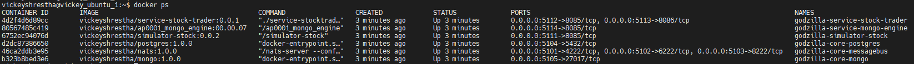

**Godzilla**

Godzilla is a microservice platform that structures an application as a collection of services that are highly maintainable, loosely coupled, independently deployable and organized around business capabilities.

**prerequisite software**
1. Docker
2. access to vickeyshrestha Dockerhub account to push images

following dependencies should be taken care when docker-compose.yaml will run
1. Nats (we can use a sample server as defined in docker-compose.yaml)
2. Mongodb - to store some KV pairs
3. Postgres db (for storing our big data)

**docker compose**
- docker-compose.yaml can be used on the server to bring up all the required containers. 
- setup docker-compose command on your linux VM using **sudo apt  install docker-compose**
- run docker-compose.yaml on one of the available servers to bring all of the image's instaces up and running
  _c:/> docker-compose -f docker-compose.yaml up -d_ (To bring up all docker instances)
  _c:/> docker-compose -f docker-compose.yaml down_ (To bring down all docker instances)
  

**please refer to each service's readme for further detail**

**troubleshooting**
If you are having difficulty to sync dependencies from vickeyshrestha/sharing-services with 404 error, just add the following to bypass the GOPROXY for private dependencies:
  export GOPROXY=direct
  export GOPRIVATE=github.com/vickeyshrestha/sharing-services
