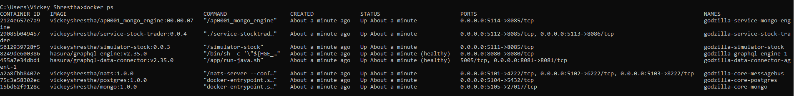

<h1>Stockzilla</h1>

Stockzilla is a **microservice** platform that structures an application as a collection of services that are highly maintainable, loosely coupled, independently deployable, and organized around business capabilities.

<h2>List of Services</h2>

**Please refer to each service's readme for further detail**

| Service                                                 |                                                         Short Description                                                         | 
|---------------------------------------------------------|:---------------------------------------------------------------------------------------------------------------------------------:| 
| Stock Trader                                            |   subscribes to a specific topic in NATS to get Stock Exchange data in a TimeSeries fashion and inserts them into Postgres db [More on ReadMe](https://github.com/vickeyshrestha/stockzilla/blob/master/services/stock-trader/readme.md)  | 
| Mongo Engine                                            |                                 connects to MongoDB to fetch the KV configurations for the client                                 | 
| File Transfer Engine                                    |                              utilizes byte streaming mechanism to transfer a huge-sized single file                               |
| Simulators/stock (Not really a Service, but a simulator) | publishes random numbers for companies listed under stock exchange into messagebus (NATS) to be consumed by other client services [More On ReadMe](https://github.com/vickeyshrestha/stockzilla/blob/master/simulators/stock/readme.md) |

<h3>prerequisite software</h3>
Docker should be installed to run the containers

The following dependencies should be taken care when docker-compose.yaml will run
1. Nats (we can use a sample server as defined in docker-compose.yaml)
2. Mongodb - to store some KV pairs
3. Postgres db (for storing our big data)
4. Hasura (GraphQL server that gives instant, realtime GraphQL APIs over Postgres)

<h3>docker compose</h3>
- docker-compose.yaml can be used on the server to bring up all the required containers 
- setup docker-compose command on your linux VM using **sudo apt  install docker-compose**
- run docker-compose.yaml on one of the available servers to bring all the image's instances up and running
  c:/> docker-compose -f docker-compose.yaml up -d (To bring up all docker instances)
  c:/> docker-compose -f docker-compose.yaml down (To bring down all docker instances)
  

**please refer to each service's readme for further detail**

<h3>troubleshooting</h3>
If you are having difficulty to sync dependencies from vickeyshrestha/sharing-services with 404 error, just add the following to bypass the GOPROXY for private dependencies:
  export GOPROXY=direct
  export GOPRIVATE=github.com/vickeyshrestha/sharing-services

<h3>Database Credentials</h3>
Refer to docker-compose file. The default username is postgres
  You can run stockzilla\services\stock-trader\database\stock-trader.sql against the database, **stockzilla**

<h3>Connect database through Hasura</h3>
go to http://localhost:8080/console
  go to Data tab
  Select Postgres and click "Connect existing Database"
  Give database name as "stockzilla"
  Under "Connect database via" option, select "Environment Variable"
  Then enter "PG_DATABASE_URL" as a variable and click "Connect"

<h3>Techstacks used:
- Golang
- Docker
- Nats Message bus
- Postgres
- Mongo DB
- Hasura
