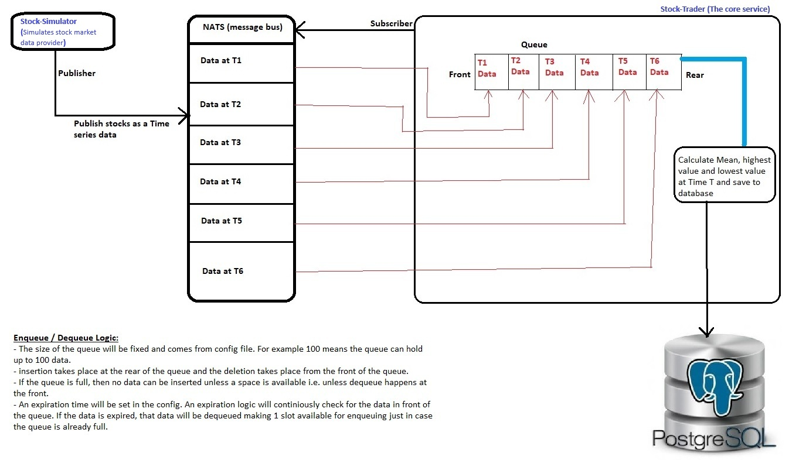

**Service - stock trader**

Service stock trader will subscribe to a specific topics in NATS (topics published by simulator - stock by default) to get NASDAQ Stock Exchange, NY Stock Exchange, and London Stock Exchange data in a timeseries fashion.

**architecture diagram**
 

**Database requirement**
 database named "stockzilla" should be taken care by docker-compose

**building and pushing docker image**
Jenkins should do it, but to do it manually, do this:
  `make push VERSION=1.0.0`

**Service endpoints**

| EndPoint Syntax           |                    Example                    |                                    Detail |
|---------------------------|:---------------------------------------------:|------------------------------------------:|
| /api/stock_trader/status  | http://localhost:8085/api/stock_trader/status | Get the health status of this application |
| /api/stock_trader/actions | http://localhost:8085/api/stock_trader/status |  Get the most recent record from postgres |
